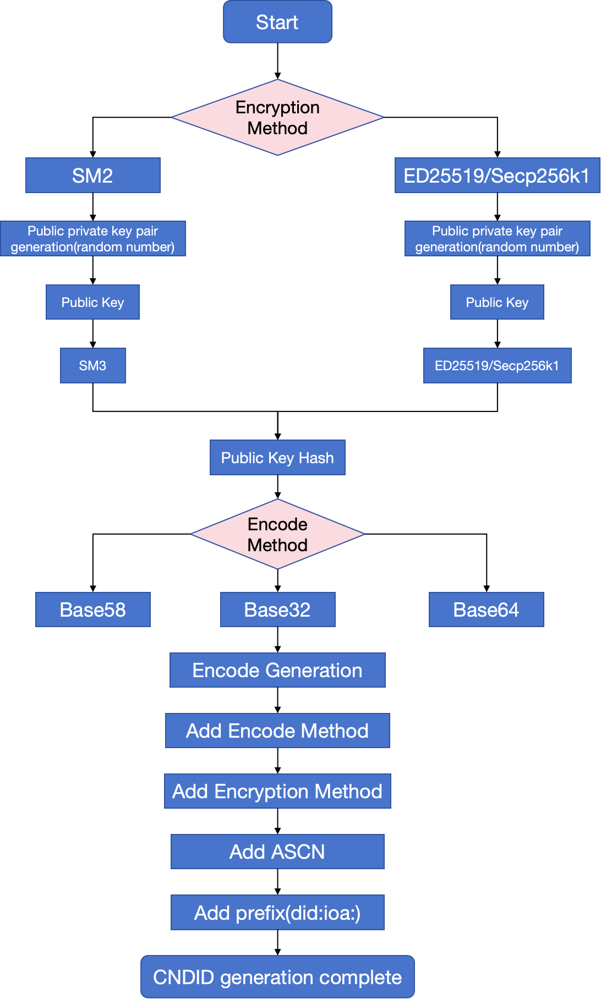

# IOA Protocol Specification

Version 1.0.0

## Introduction

IOA (Internet of Agents) is a **W3C DID method `did:ioa`** on blockchain, providing decentralized, rights-delegated digital identity services with emphasis on data security and privacy protection for the agent internet. Agents, registration nodes, and organizations can register DID documents on chain via `did:ioa` to express identity, capabilities, and reachability, supporting cross-node registration, discovery, and interconnection.

DID documents focus on parseable information such as who the subject is, what capabilities they have, and how to connect (on-chain registration, discovery, and interconnection; see §4). Verifiable credentials (VCs) are issuer assertions over subject attributes (e.g. registration status, capability scope, affiliated organization) under the [W3C Verifiable Credentials Data Model](https://www.w3.org/TR/vc-data-model/), for verification and policy decisions. The two complement each other: `credentialSubject.id` is usually the subject `did:ioa`; the VC root `id` may be an independent URN and need not match the DID path; fields need not mirror the DID document one-to-one.

§4 uses [W3C DID Core](https://www.w3.org/TR/did-core/) fields at the document top level; IOA agent and on-chain extensions live in `extension`. On-chain registration API: §5. For background on DIDs and method specifications, see [DID Primer](https://github.com/WebOfTrustInfo/rebooting-the-web-of-trust-fall2017/blob/master/topics-and-advance-readings/did-primer.md) and [DID Specification](https://www.w3.org/TR/did-core/).

## Design Goals

| Goal | Description | Normative sections |
|------|-------------|-------------------|
| **Registration** | Agents, organizations, or registration nodes obtain a unique, verifiable `did:ioa` and register a DID document on chain. | §3 Identifier, §5.1 Create |
| **Discovery** | Resolvers obtain capability descriptions and service endpoints from documents for lookup and matching. | §2.1, §5.2 Read, `service` (including sidechain resolution) |
| **Interconnection** | Peers connect via `serviceEndpoint` and protocol capabilities (e.g. A2A). | §4.1.2 `AgentDescription` |
| **Governance & Security** | Key control, recovery, deactivation, and privacy minimization. | §5.3–5.5, §6 |

## Document Status

This document is version v1.0.0 of the IOA protocol specification. The latest version is available in this repository as the [English edition](IOA%20Protocol%20Specification.md).

## 1. IOA Namespace

- The method name for this `DID` method is: `ioa`
- `DID`s using this method **MUST** begin with the prefix `did:ioa`. This string **MUST** be lowercase. The remainder of the DID after the prefix is generated by a specific algorithm.

## 2. Applicable Systems

IOA applies to blockchain networks and is used formally from the network’s release onward.

### 2.1 DID Resolution

**Normative resolution** for this method is §5.2 **Read**: send `operation: "read"` to an on-chain registration node; on success, obtain a §4-conformant DID document from `data.didDocument` (without request-side `proof`).

For DIDs with an **acsn** (e.g. `did:ioa:tele`), resolve the main-chain document first, read the `DIDSubResolver` service entry, then query the target DID via that resolver. Sidechain Read uses the same request/response shape as §5.2, implemented by the sidechain registration node.

## 3. IOA Identifier

### 3.1 IOA

- `IOA` is structured as follows:


- **Agents and general subjects** (default): `did:ioa:` + **suffix** (22–42 alphanumeric characters derived from encoded public key; see generation steps below). For example, `did:ioa:sfHBuFa7asqWztQJ3nZUiHtXjSJsyqEp` identifies an agent.

- **Optional acsn**: a four-character prefix segment (per ABNF below) for special types. For example, `did:ioa:tele` has acsn only (no suffix) and is used for sidechain resolution; the corresponding DID document stores sidechain resolver addresses.
- `IOA` is initialized by the following `ABNF`:

```plaintext
ioa-did = "did:ioa:" ioa-specific-identifier ; fixed prefix did:ioa
ioa-specific-identifier = 0*1(acsn ":") suffix / acsn ":" 0*1(suffix)
acsn (optional): suffix or acsn: suffix (optional)
acsn = 4(ALPHA / DIGIT); a combination of 4 letters or digits
suffix = (22,42)(ALPHA / DIGIT); a combination of letters or digits with a length range of 22-42
```

- The steps for generating a IOA address are defined as follows:

1. Select an encryption algorithm (e.g., SM2, ED25519, or Secp256k1).
2. Generate a public-private key pair.
3. Encode the public key using Base58, Base64, or Base32 encoding methods.
4. Concatenate the prefix `did:ioa:` with the encoded public key string to form the complete IOA (generation flow diagram: `image/generateIOA.png`, asset pending).



Encryption methods:

| Cryptographic Algorithm | Encryption Type |
| ----------------------- | --------------- |
| SM2                     | 'z'             |
| ED25519                 | 'e'             |
| Secp256k1               | 's'             |

Encoding methods:

| Encoding Algorithm | Encoding Type |
| ------------------ | ------------- |
| Base58             | 'f'           |
| Base64             | 's'           |
| Base32             | 't'           |

## 4. IOA Document Specification

IOA DID documents follow [DID Core](https://www.w3.org/TR/did-core/): interoperable fields at the top level; IOA method extensions in an `extension` object. Create/Update requests may carry `proof` at the request top level (§5), not in the §4.3 resolution document.

### 4.1 Field Description

#### 4.1.1 DID Core

- `@context`: **Required**. JSON-LD context array; **must** include `https://www.w3.org/ns/did/v1`. For secp256k1 verification keys, **should** include `https://w3id.org/security/suites/secp256k1-2019/v1`.
- `id`: **Required**. The `did:ioa` identifier for this document.
- `verificationMethod`: **Required** (`did:ioa:tele` and similar system resolver DIDs **MAY** use empty arrays; see §4.3). Array of verification methods; each entry includes:
  - `id`: verification method ID (**must** be `{did}#{fragment}`).
  - `type`: verification key type, e.g. `EcdsaSecp256k1VerificationKey2019` (secp256k1), or other W3C security suite types supported by the implementation.
  - `controller`: DID controlling the key, usually the document `id`.
  - Key material: e.g. `publicKeyCompressed` (secp256k1 compressed public key, hexadecimal), depending on `type` and suite context.
- `authentication`: **Required**. List of `verificationMethod` `id` values (with `#fragment`) for document control and on-chain operation authorization.
- `version`: Recommended. Document version string (e.g. `1.0.0`).
- `service`: Optional. Service endpoint array; see §4.1.2.
- `alsoKnownAs`: Optional. Associated identifier array; each entry has `type` and `id`.
- `created` / `updated`: Optional ISO-8601 timestamps.

#### 4.1.2 `service`

**Type A: `AgentDescription` (agent registration and discovery)**

- `id`, `type` (fixed value `AgentDescription`)
- `name`, `description`: agent name and description
- `capabilities`:
  - `tags`: **array of strings**; each element is one or more comma-separated capability/task codes (same code system as `extension.taskType` / platform dictionary; see §4.1.4).
  - `skills`: array of skill name strings.
  - `protocol`: array of interconnection protocol identifiers (e.g. `A2A`).
- `serviceEndpoint`: **array of strings** (reachable URIs)

**Type B: `DIDSubResolver` (sidechain resolution)**

For `did:ioa:tele` etc.: `id`, `type` (`DIDSubResolver`), `version`, `serverType`, `protocol`, `serviceEndpoint` (string), `port`. See §4.1.4 for `serverType` and `protocol`.

#### 4.1.3 `extension` (IOA method extension)

| Field                                          | Description                                                     | Optional                              |
| ---------------------------------------------- | --------------------------------------------------------------- | ------------------------------------- |
| `taskType`                                     | Agent task type codes (comma-separated)                         | Recommended for agents                |
| `applicationDomain`                            | Application domain codes                                        | Recommended for agents                |
| `companyDid` / `companyName`                   | Affiliated organization                                         | Optional                              |
| `registrationNodeDid` / `registrationNodeName` | Registration node                                               | Optional                              |
| `recovery`                                     | Recovery verification method ids                                | Optional                              |
| `ttl`                                          | Resolver cache TTL (seconds)                                    | Recommended for on-chain registration |
| `attributes`                                   | Attribute objects (`key`, `desc`, `encrypt`, `format`, `value`) | Optional                              |
| `acsns`                                        | Sidechain AC numbers                                            | Optional                              |
| `verifiableCredentials`                        | Credential references (`id`, `type`)                            | Optional                              |
| `delegateSign`                                 | Delegated signature (`signer`, `signatureValue`)                | Optional                              |
| `type`                                         | Document property type (integer)                                | Optional                              |

#### 4.1.4 Codes and Enumerations

**`DIDSubResolver.serverType` (resolver address type)**

| Value | Meaning |
|-------|---------|
| 1 | URL address (HTTP/HTTPS, used with `serviceEndpoint`) |

**`DIDSubResolver.protocol` (transport protocol)**

| Value | Meaning |
|-------|---------|
| 1 | TCP |
| 2 | WebSocket |
| 3 | HTTP/HTTPS (same JSON POST API as §5) |

Implementations **MAY** extend values not listed; clients **SHOULD** ignore unknown values.

**`extension.taskType` / `extension.applicationDomain`**

Platform dictionary codes as **comma-separated strings** in `extension` (e.g. `"0503,0501"`). Code tables are maintained by the registration node or platform dictionary; this specification does not enumerate them.

**`extension.type` (document property type, optional)**

| Value | Meaning |
|-------|---------|
| 206 | Agent DID document (commonly used in implementations) |

**`alsoKnownAs.type`**

Integer category for associated identifiers; semantics defined by implementation or business dictionary.

**`extension.verifiableCredentials[].type` (credential reference type)**

| Value | Meaning |
|-------|---------|
| 1 | On-chain verifiable claim reference (legacy implementations) |
| 2 | External W3C VC reference (`id` is a VC identifier URI/URN; issued by the issuer per the VC data model; `credentialSubject.id` is usually the subject `did:ioa`) |

**`extension.delegateSign` (delegated signature, optional)**

Used by trusted resolvers and similar flows: the delegate attests to the integrity of the document’s `verificationMethod` array.

| Field | Description |
|-------|-------------|
| `signer` | Verification method `id` of the signer |
| `signatureValue` | Base58 signature over the `verificationMethod` array using the same canonical serialization as §5.0.2, produced with the private key for `signer` |

Resolvers **MAY** verify `delegateSign` before caching; if absent, follow normal DID resolution.

### 4.2 Structure Definitions

**DIDDocument**

| Field | Type | Description | Optional |
|-------|------|-------------|----------|
| Context | []string | JSON-LD `@context` | Required |
| ID | string | `did:ioa` identifier | Required |
| VerificationMethod | []VerificationMethod | Verification methods | Required |
| Authentication | []string | Verification method id list | Required |
| Version | string | Document version | Recommended |
| Service | []Service | Service array | Optional |
| AlsoKnownAs | []AlsoKnownAs | Associated identifiers | Optional |
| Extension | Extension | IOA extension | Recommended |
| Created | string | Creation time | Optional |
| Updated | string | Update time | Optional |

**VerificationMethod**

| Field | Type | Description | Optional |
|-------|------|-------------|----------|
| ID | string | Verification method id (with fragment) | Required |
| Type | string | e.g. `EcdsaSecp256k1VerificationKey2019` | Required |
| Controller | string | Controlling DID | Required |
| PublicKeyCompressed | string | secp256k1 compressed public key (hex) | Per type |

**Extension** — fields per §4.1.3.

**AgentDescription (service)**

| Field | Type | Description | Optional |
|-------|------|-------------|----------|
| ID | string | Service id | Required |
| Type | string | `AgentDescription` | Required |
| Name | string | Name | Required |
| Description | string | Description | Recommended |
| Capabilities | object | `tags`, `skills`, `protocol` | Recommended |
| ServiceEndpoint | []string | URI list | Required |

**DIDSubResolver (service)** — per §4.1.2 type B.

**Proof** (§5 requests only; not part of normative resolution document)

| Field | Type | Description |
|-------|------|-------------|
| Creator | string | Verification method id |
| SignatureValue | string | Signature value |

### 4.3 Document Examples

**Agent DID document**:

```json
{
    "@context": [
        "https://www.w3.org/ns/did/v1",
        "https://w3id.org/security/suites/secp256k1-2019/v1"
    ],
    "id": "did:ioa:sfHBuFa7asqWztQJ3nZUiHtXjSJsyqEp",
    "verificationMethod": [{
        "id": "did:ioa:sfHBuFa7asqWztQJ3nZUiHtXjSJsyqEp#secp256k1-6cda3f6e",
        "type": "EcdsaSecp256k1VerificationKey2019",
        "controller": "did:ioa:sfHBuFa7asqWztQJ3nZUiHtXjSJsyqEp",
        "publicKeyCompressed": "03bc5e9cea08abaa5d2062847064535ccab5a460ce70d32de403bc62caa5eb418e"
    }, {
        "id": "did:ioa:sfHBuFa7asqWztQJ3nZUiHtXjSJsyqEp#secp256k1-recovery01",
        "type": "EcdsaSecp256k1VerificationKey2019",
        "controller": "did:ioa:sfHBuFa7asqWztQJ3nZUiHtXjSJsyqEp",
        "publicKeyCompressed": "02aaaaaaaaaaaaaaaaaaaaaaaaaaaaaaaaaaaaaaaaaaaaaaaaaaaaaaaaaaaaaaaa"
    }],
    "authentication": [
        "did:ioa:sfHBuFa7asqWztQJ3nZUiHtXjSJsyqEp#secp256k1-6cda3f6e"
    ],
    "version": "1.0.0",
    "service": [{
        "id": "did:ioa:sfHBuFa7asqWztQJ3nZUiHtXjSJsyqEp#agent-description",
        "type": "AgentDescription",
        "name": "Legal Risk Assessment Agent",
        "description": "A professional legal risk assessment agent that performs comprehensive legal risk assessment on contracts, agreements, and legal documents, identifies potential legal risk points, and provides professional risk assessment reports and risk mitigation recommendations.",
        "capabilities": {
            "tags": ["0503,0501", "0701,0702,0703,0704"],
            "skills": ["Legal risk assessment"],
            "protocol": ["A2A"]
        },
        "serviceEndpoint": ["http://127.0.0.1:9090"]
    }],
    "extension": {
        "taskType": "0503,0501",
        "applicationDomain": "0701,0702,0703,0704",
        "companyDid": "did:ioa:sfuCqVuDmycvFXb3pkTZ6fFW86sKDtn1",
        "companyName": "Test Organization",
        "registrationNodeDid": "did:ioa:sfJmAbKzPNdYF9WNZ2Jv5rK1qn8VaHpm",
        "registrationNodeName": "Agent Internet Registration Node",
        "recovery": [
            "did:ioa:sfHBuFa7asqWztQJ3nZUiHtXjSJsyqEp#secp256k1-recovery01"
        ]
    }
}
```

The example above is a readable golden sample for resolution/display. On-chain **Create**, `extension` **should** also include `ttl` (§5.1); agent documents **should** include `extension.type`: `206` (§4.1.4).

**Sidechain resolver example** (`service.type` = `DIDSubResolver`):

```json
{
    "@context": ["https://www.w3.org/ns/did/v1"],
    "id": "did:ioa:tele",
    "verificationMethod": [],
    "authentication": [],
    "version": "1.0.0",
    "service": [{
        "id": "did:ioa:tele#subResolve",
        "type": "DIDSubResolver",
        "version": "1.0.0",
        "serverType": 1,
        "protocol": 3,
        "serviceEndpoint": "https://resolver.ioa.org",
        "port": 8080
    }],
    "extension": {
        "ttl": 86400
    }
}
```

## 5. IOA Methods

§5 defines the on-chain registration node HTTP API. Normative DID resolution is §2.1 (§5.2 Read).

### 5.0 Common Conventions

#### 5.0.1 Transport

All §5 operations use a **single HTTP endpoint**:

- **Method**: `POST`
- **`Content-Type`**: `application/json; charset=utf-8`
- **Request body**: JSON object with required `id` and `operation`; Create/Update/Recovery **must** include `didDocument`; authorized operations **must** include top-level `proof` (not inside `didDocument`)
- **Response body**: JSON with `errorCode` and `message`; Read success also includes `data.didDocument` (see §5.6)

**Example** (base URL is deployment-specific):

```http
POST /api/v1/ioa HTTP/1.1
Host: registry.example.ioa
Content-Type: application/json; charset=utf-8

{"id":"did:ioa:sfHBuFa7asqWztQJ3nZUiHtXjSJsyqEp","operation":"read"}
```

#### 5.0.2 Request `proof` and Signing

[DID Core](https://www.w3.org/TR/did-core/) uses verifiable proofs to validate control relationships; resolved DID documents (§4.3) **do not** embed `proof` (consistent with DID Core 1.0). On-chain Create/Update/Deactivate/Recovery carry an IOA-specific simplified top-level `proof`:

| Field | Description |
|-------|-------------|
| `creator` | Verification method `id` (with `#fragment`) |
| `signatureValue` | Signature string |

**Authorization** (aligned with DID Core `authentication`):

| Operation | `proof.creator` **must** be listed in |
|-----------|---------------------------------------|
| Create / Update | `didDocument.authentication` in the request body |
| Deactivate | `extension.recovery` on the **on-chain stored** DID document (Deactivate requests omit `didDocument`) |
| Recovery | `didDocument.extension.recovery` in the request body |

For Deactivate / Recovery, the registration node **SHOULD** check `proof.creator` against the `recovery` list on the **on-chain document before the operation**.

**Payload to sign**: remove the `proof` key from the request JSON, then serialize the remainder as UTF-8 **compact JSON** (object keys in Unicode code-point ascending order, no extra whitespace; arrays and nested objects follow the same rule recursively).

**Algorithm and encoding** (must match the `verificationMethod` referenced by `creator`):

- For `EcdsaSecp256k1VerificationKey2019`: **SHA-256** hash of the payload, **ECDSA** sign with secp256k1 private key; `signatureValue` is **Base58** encoding of the signature (no checksum). Verify with the matching `publicKeyCompressed` (hex) in the document.
- Other suite types are implementation-defined; **SHOULD** be documented at deployment time.

The registration node **MUST** verify the signature and `creator` authorization per the table above before executing the operation.

**Alignment with implementations**: The serialization and encoding above are **recommended** interoperability rules. If an on-chain registry uses different JSON canonicalization or signature encoding, it **MUST** document that in deployment docs; clients **SHOULD** generate `proof` per the target registry’s documentation.

### 5.1 Create

The registration interface registers an IOA document (transport and `proof`: §5.0). `didDocument` **must conform to §4**; top-level `id` **must** equal `didDocument.id`. Duplicate creation is not allowed.

#### Request Parameters

| Parameter   | Field Type | Description                  |
| ----------- | ---------- | ---------------------------- |
| id          | String     | IOA to be created          |
| operation   | String     | "create"                     |
| proof       | Object     | Signature; see §5.0.2 |
| didDocument | Object     | IOA document to be created |

#### Request Example

`didDocument` matches §4.3 agent example; on-chain Create **should** include `extension.ttl`, and agent documents **should** include `extension.type`: `206` (§4.1.4); `proof.creator` is the primary key in `authentication`.

```json
{
    "id": "did:ioa:sfHBuFa7asqWztQJ3nZUiHtXjSJsyqEp",
    "operation": "create",
    "proof": {
        "creator": "did:ioa:sfHBuFa7asqWztQJ3nZUiHtXjSJsyqEp#secp256k1-6cda3f6e",
        "signatureValue": "2ExbMiHRpGSWxyZAwGgD4YnWUyXxhsp4F8mwGzE43VNrS3p3kru8JroVuox8AyXpyZrPhoepAUVtLwn3HyKnoXFcx1n"
    },
    "didDocument": { "...": "same as §4.3 agent DID document; extension adds ttl: 86400, optional type: 206" }
}
```

#### Response Example

```json
{
    "errorCode": 0,
    "message": "success"
}
```

### 5.2 Read

Query the DID document for a given IOA (**normative resolution**, §2.1). The response is a JSON object containing `errorCode` and, on success, `data.didDocument`.

#### Request Parameters

| Parameter | Field Type | Description          |
| --------- | ---------- | -------------------- |
| id        | String     | The IOA to be read |
| operation | String     | Must be `"read"` |

#### Request Example

```json
{
    "id": "did:ioa:sfHBuFa7asqWztQJ3nZUiHtXjSJsyqEp",
    "operation": "read"
}
```

#### Response Data

| Parameter | Field Type | Description |
|-----------|------------|-------------|
| errorCode | Int | See §5.6 |
| message | String | Human-readable description (recommended) |
| data.didDocument | Object | Resolution result; field definitions in §4.1 (no embedded `proof`) |

The structure of each `extension.attributes` array element is as follows:

| Parameter | Field Type | Description |
|-----------|------------|-------------|
| data.didDocument.extension.attributes.key | String | Attribute key |
| data.didDocument.extension.attributes.desc | String | Attribute description |
| data.didDocument.extension.attributes.encrypt | Int | 0 = plain, 1 = encrypted |
| data.didDocument.extension.attributes.format | String | e.g. image, text, video |
| data.didDocument.extension.attributes.value | String | Custom value |

When `service.type` is `AgentDescription` or `DIDSubResolver`, see §4.1.2.

#### Response Example

- Successful agent document: `data.didDocument` matches §4.3 agent example (**without** `proof`).

```json
{
    "errorCode": 0,
    "message": "success",
    "data": {
        "didDocument": { "...": "same as §4.3 agent DID document" }
    }
}
```

- Successful sidechain resolver document: `data.didDocument` matches §4.3 `DIDSubResolver` example.

```json
{
    "errorCode": 0,
    "message": "success",
    "data": {
        "didDocument": { "...": "same as §4.3 sidechain resolver example" }
    }
}
```

### 5.3 Update

The update interface updates an IOA document (transport and `proof`: §5.0). `authentication` **must not** be modified; `proof.creator` must be a verification method `id` in `authentication`.

| Parameter   | Field Type | Description                |
| ----------- | ---------- | -------------------------- |
| id          | String     | The IOA to be updated    |
| operation   | String     | "update"                   |
| proof       | Object     | Signature; see §5.0.2 |
| didDocument | Object     | The updated IOA document |

#### Request Example

`didDocument` is based on §4.3 agent example; `version`, `service`, `extension`, etc. may change; `authentication` stays the same.

```json
{
    "id": "did:ioa:sfHBuFa7asqWztQJ3nZUiHtXjSJsyqEp",
    "operation": "update",
    "proof": {
        "creator": "did:ioa:sfHBuFa7asqWztQJ3nZUiHtXjSJsyqEp#secp256k1-6cda3f6e",
        "signatureValue": "hLDyzcMbSpaV74RRqaN7bBqbN43Zm8FfqQdUmmGkZitVRiV5sHYv2JEkyxCtNLtw1iMJzSaUtKwgUrjop5JCGdCPwN"
    },
    "didDocument": { "...": "same as §4.3 agent DID document; version, service, extension, etc. may be updated" }
}
```

#### Response Example

```json
{
    "errorCode": 0,
    "message": "success"
}
```

### 5.4 Deactivate

The deactivate interface revokes an IOA document (transport: §5.0). After deactivation, the on-chain record is updated to a **deactivated document** (below); the DID entry is not deleted. `proof.creator` must be a verification method `id` listed in `extension.recovery` on the **on-chain stored** document; `operation` is `"deactivate"`.

| Parameter | Field Type | Description |
|-----------|------------|-------------|
| id | String | The IOA to be deactivated |
| operation | String | `"deactivate"` |
| proof | Object | Signature; see §5.0.2 |

**On-chain document after deactivation** (Read for a deactivated DID returns `errorCode: 1`, see §5.6):

```json
{
    "@context": ["https://www.w3.org/ns/did/v1"],
    "id": "did:ioa:sfHBuFa7asqWztQJ3nZUiHtXjSJsyqEp",
    "verificationMethod": [],
    "authentication": []
}
```

Only `id` and empty verification relationships remain; **must not** include `service`, `extension`, or other business fields. A deactivated DID **must not** undergo §5.5 Recovery.

#### Request Example

```json
{
    "id": "did:ioa:sfHBuFa7asqWztQJ3nZUiHtXjSJsyqEp",
    "operation": "deactivate",
    "proof": {
        "creator": "did:ioa:sfHBuFa7asqWztQJ3nZUiHtXjSJsyqEp#secp256k1-recovery01",
        "signatureValue": "w9uH8kx5kyo2vdsWz8aELJZhsdYPokf9Rnh67Yra5Lo49KHteAGmF7hzXiVmJVbXR7jMkDmj1zZuWqvfiKehenirUg"
    }
}
```

#### Response Example

```json
{
    "errorCode": 0,
    "message": "success"
}
```

### 5.5 Recovery

The recovery interface resets `authentication` and `verificationMethod` when the primary private key is lost (transport and `proof`: §5.0). It applies **only to active documents that have not been Deactivated (§5.4)** and still have `extension.recovery` on chain. `proof.creator` must be a verification method `id` listed in `didDocument.extension.recovery` in the request body.

**Recovery must not** be used for a deactivated DID: after deactivation there is no `extension.recovery` on chain, and Read returns `errorCode: 1` (§5.6). Re-enabling a `did:ioa` after deactivation is out of scope for §5.5 and is defined by the registry implementation or governance process.

| Parameter   | Field Type | Description               |
| ----------- | ---------- | ------------------------- |
| id          | String     | The IOA to be recovered |
| operation   | String     | "recovery"                |
| proof       | Object     | Signature; see §5.0.2 |
| didDocument | Object     | The updated DID document  |

#### Request Example

`didDocument` replaces `authentication` and `verificationMethod` with a new controlling key; `extension.recovery` should remain as in §4.3.

```json
{
    "id": "did:ioa:sfHBuFa7asqWztQJ3nZUiHtXjSJsyqEp",
    "operation": "recovery",
    "proof": {
        "creator": "did:ioa:sfHBuFa7asqWztQJ3nZUiHtXjSJsyqEp#secp256k1-recovery01",
        "signatureValue": "2ESSXREizoYDfkp7t5MnmqkaAtAykBi45ri2mkc3Tr1XHd1JQAnaMrxpnodqSFADw2SacNrHNmjf6KQb7BYBgyJbaKi"
    },
    "didDocument": { "...": "new authentication/verificationMethod; extension.recovery same as §4.3" }
}
```

#### Response Example

```json
{
    "errorCode": 0,
    "message": "success"
}
```

### 5.6 Response Codes

All §5 interfaces **SHOULD** return `errorCode` (integer) and `message` (string). Read responses on success also include `data.didDocument`. `errorCode` 0 means success; non-zero indicates failure and **SHOULD** be explained in `message`.

| errorCode | Description |
|-----------|-------------|
| 0 | Success |
| 1 | Document not found or deactivated |
| 2 | Document already exists (duplicate Create) |
| 3 | Invalid signature or unauthorized `proof.creator` |
| 4 | Invalid request parameters |
| 5 | Operation not allowed (e.g. Update changing `authentication`) |
| Other | Implementation-defined; **MUST** be explained in `message` |

#### Failure response examples

```json
{
    "errorCode": 1,
    "message": "DID document not found or deactivated"
}
```

```json
{
    "errorCode": 3,
    "message": "Invalid proof signature or unauthorized proof.creator"
}
```

```json
{
    "errorCode": 5,
    "message": "Update must not modify authentication"
}
```

---

The above completes the **IOA Methods** section (create, read, update, deactivate, recovery, and response codes).

## 6. Security and Privacy Considerations

### 6.1 Security Considerations

- **Verification key integrity**: IOA `verificationMethod` entries are stored on the blockchain, ensuring they cannot be tampered with.
- **Private Key Protection**: Private keys must be securely stored to prevent leakage to unauthorized third parties.
- **On-chain request signatures**: Registration nodes **MUST** verify `proof` per §5.0.2; requests with invalid signatures or unauthorized `proof.creator` **MUST** be rejected.
- **Recovery key scope**: Verification methods listed in `extension.recovery` are for Deactivate/Recovery only (§5.4, §5.5) and **must not** authorize Create/Update; **must not** use §5.5 on a deactivated DID; operators should consider rotating recovery keys after a successful recovery.
- **Preventing Man-in-the-Middle Attacks**: Protect the transmission of IOA documents using encryption (e.g., TLS).
- **Identity Recovery Mechanism**: If the primary private key is lost and the document is **not deactivated**, use §5.5 Recovery with a recovery key to reset `authentication` (requires `extension.recovery` on an active document).

### 6.2 Privacy Considerations

- **Data Minimization**: Only necessary information is stored on the blockchain, such as verification keys and service endpoints, avoiding the storage of sensitive information.
- **Privacy Protection**: Use encryption techniques (e.g., homomorphic encryption) to protect sensitive data and prevent privacy leaks.
- **Access Control**: Control access to IOA and its associated services using encryption methods.
- **Anonymization Techniques**: Use anonymization techniques (e.g., zero-knowledge proofs) to protect user privacy when necessary.